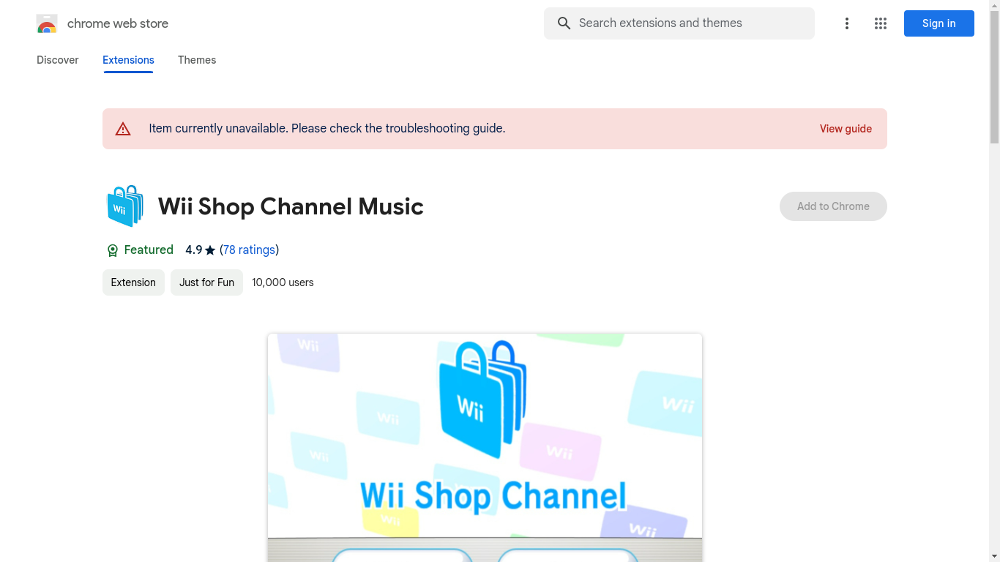

# CED, or Chromium Extensions Downloader

> A console program that gives you a link to quickly download your favorite extensions in a Chromium-based browser.

## Problem

My browser won't let me download extensions.

## How do you download an extension

To download an extension, your browser uses this link :
`https://clients2.google.com/service/update2/crx?response=redirect&acceptformat=crx2,crx3&prodversion=[VERSION]&x=id%3D[EXTENSION_ID]%26installsource%3Dondemand%26uc`.

What varies in this link is your Chromium version, which you can find on `chrome://version`, and the extension id, which is in the extension link.

## Solution

I don't want to write by hand the download link, so I made CED.

To get a proper link, you just call the program like this : `./ced chromium_version extension_link`

Then CED will show you the link to download the extension, you just have to copy it.

## Example

Let's say my Chromium version is 121.0.6167.184, and I want to download Wii Shop Channel Music.

I just have to type : `./ced 121.0.6167.184 https://chromewebstore.google.com/detail/wii-shop-channel-music/camjnljbmplngaalikoefoibonimfhkd`

Pasting the link will download the crx file and, when it's done, ask you if you want to install the extension.

## One downside

The downloaded crx file will remain on your computer, but you can delete it without any problem. It won't affect the extension.

